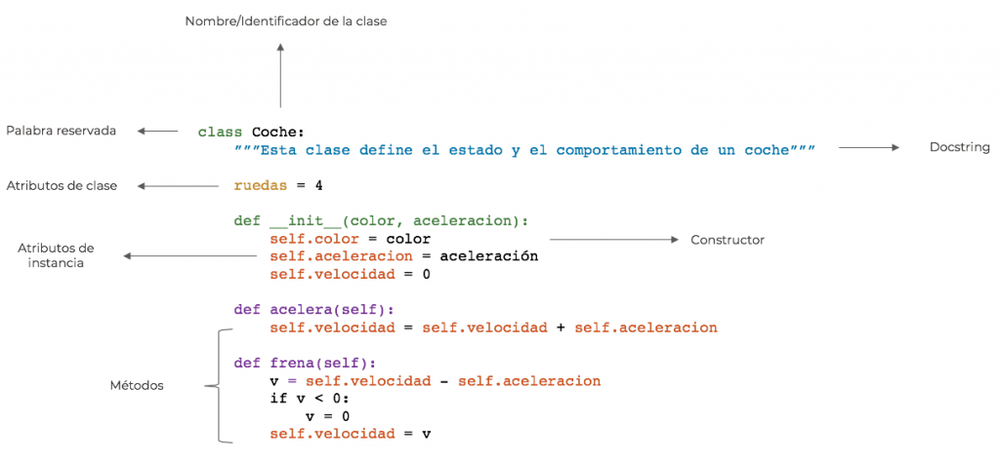

# PROGRAMACION  ORIENTADOS A OBJETOS (POO)

## EN INGLES ES OBJECT ORIENT PROGRAMING(OOP)
es un paradigma de programacion que hace que los programadores puedan disponer de un medio a partir del cual estructurar programas de tal forma que las propiedades y comportamientos de mismo se puedan agrupar en objetos individuales.
> **paradigma** es un modelo, patron o ejemplo que se debe seguir 
**oop** es un modelo de como programar.

> **objetivo** - el objetivo es organizar el codigo de manera que se asemeje a como pensamos en la vida real.

se basa en objetos
y en la **poo** un objeto es toda entidad que se puede describir a travez 
de **atributos** y **funciones** que puede realizar la entidad.

